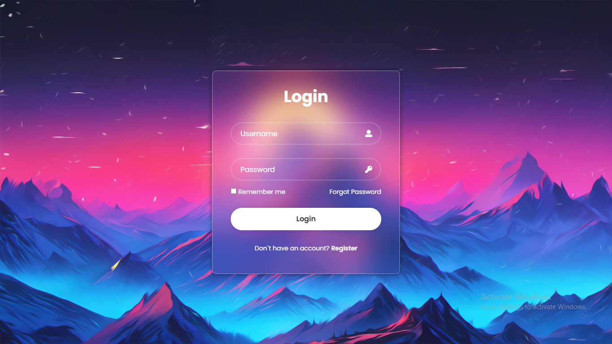
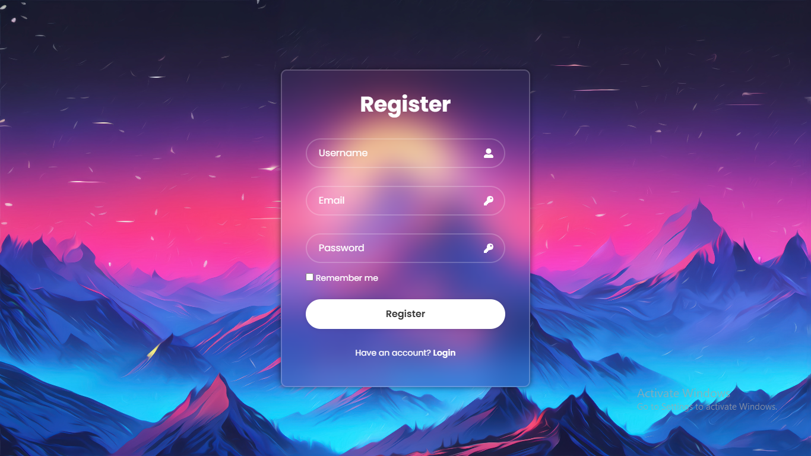
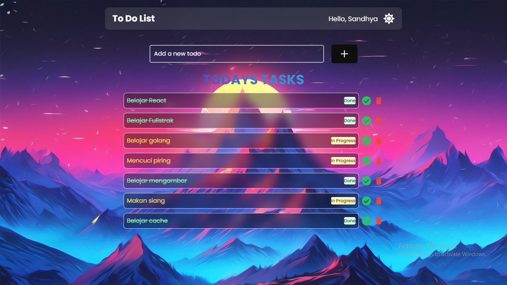

# To-Do List App

A simple To-Do List app built with **React**, **Vite.js**, **Golang Fiber**, and **MongoDB**. This app allows users to add, edit, and delete tasks. The tasks are stored in a **MongoDB** database.

## Features

- User registration and login
- Add new tasks
- Edit existing tasks
- Delete tasks
- Store tasks in MongoDB
- User authentication with JWT (JSON Web Token)

## Tech Stack

- **Frontend**: 
  - React
  - Vite.js
- **Backend**: 
  - Golang Fiber
  - MongoDB
  - JWT (for authentication)

## Getting Started

### Prerequisites

Before running this project, make sure you have the following installed:

- **Node.js** (for running React app)
- **Golang** (for the backend server)

### Clone the Repository

First, clone this repository to your local machine:

```bash
git clone https://github.com/Sandhya-Pratama/todo-app.git
```

### Frontend (React + Vite.js)

1. Navigate to the frontend directory:

   ```bash
   cd client
   ```

2. Install dependencies:

   ```bash
   npm install
   ```

3. Run the development server:

   ```bash
   npm run dev
   ```

   This will start the React app on `http://localhost:5173`.

### Backend (Golang Fiber + MongoDB)

1. Navigate to the backend directory:

   ```bash
   cd server
   ```

2. Install dependencies:

   ```bash
   go mod tidy
   ```

3. Set up MongoDB:

   - Ensure you have a running instance of MongoDB.
   - Update the MongoDB connection URL in the backend code.

4. Run the server:

   ```bash
   go run main.go
   ```

   The backend will run on `http://localhost:5000`.

### Configuration

Make sure to update the following environment variables in the backend:

- **MONGO_URI**: MongoDB connection URI.

## Usage

1. **User Registration**: 
   - Go to the register page (`/register`) to create a new account.
   - Provide the required details: username, email, and password.

2. **User Login**: 
   - Go to the login page (`/login`) to authenticate.
   - After logging in, you will receive a JWT token that is used for subsequent API requests.

3. **Managing Tasks**:
   - Once logged in, you can add, edit, or delete tasks.
   - Tasks are stored in MongoDB and are associated with your user.

## Screenshots

- **Login Page**:
  

- **Register Page**:
  

- **To do list**:
  


